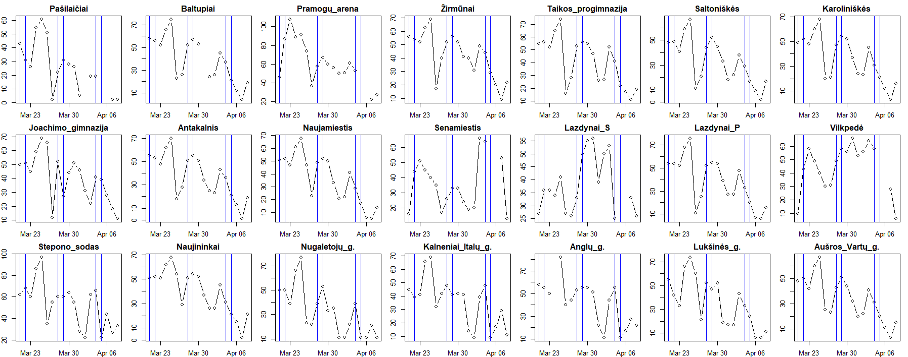

# Vilnius Air Pollution Analysis (March 21 – April 8, 2026)

## Introduction
This is a data-driven investigation into the temporal and spatial variations of ambient air pollution ($PM_{2.5}$ / $PM_{10}$) across different urban sectors in Vilnius, Lithuania. The study spans from **March 21 to April 8, 2026**, capturing a crucial early-spring transitional meteorological period. Data was collected from iqair.com, archyvas.meteo.lt and judu.lt websites. Some data is missing.

The primary objective of this analysis was to determine whether air quality fluctuations during these weeks were governed by local anthropogenic activities (such as traffic variations) or large-scale macro environmental drivers (such as temperature and wind behavior).

---

## Air Pollution Overview & Macro Trends

Urban particulate matter air pollution typically stems from three main sources: industrial manufacturing, residential heating (private chimneys), and vehicular traffic. To understand the baseline background of Vilnius, the following regional filters were applied conceptually:
* **Industrial Factories:** The vast majority of heavy production plants are located far outside the city perimeter.
* **Residential Heating:** While residential wood/coal burners heavily impact specific sub-districts, many monitored areas in central and high-density residential sectors lack private housing entirely.
* **Vehicular Traffic:** Because factories are distant and residential heating is localized, **automobiles** remain the primary baseline contributor to particulate matter accumulation within the urban canopy.

### City-Wide Synchronous Decline
An analysis of the data revealed that particulate matter concentrations exhibited a nearly identical downward trend across most of the monitoring stations in the city. 

As shown in **Figure 1**, despite geographical differences—ranging from high-traffic zones like *Saltoniškes* and *Savanoriai/Vilkpėdė* to greener neighborhoods like *Turniškės/Nugalėtojų g.*—the pollution metrics peaks and valleys move in unison. Because local vehicle usage does not drop simultaneously across the entire city, this synchronous multi-regional decline indicates that a global, macro-scale variable was driving the overall air cleaning process. 

### The Temperature Resuspension Mechanism
The most prominent macro variable correlating with this trend was temperature, which experienced a steady decline during this period. In environmental physics, spring temperatures strongly regulate road dust dynamics:
* **Higher Temperatures:** Rapidly dry out asphalt and soil surfaces. This allows the mechanical energy of passing cars and ambient wind to easily lift resuspended road dust ($PM_{2.5}$ and $PM_{10}$) back into the breathing zone.
* **Lower Temperatures:** Keep surface moisture locked on the pavement longer, preventing micro-particles from being swept into the atmosphere by traffic. 

---

## Regional Analysis & Micro-Scale Impacts

To validate whether local traffic could be ruled out as the primary cause of the day-to-day fluctuations, a granular sub-regional study was conducted by cross-referencing pollution spikes with passing car volumes on adjacent streets.

### 1. Traffic Volume Consistency

<em>Figure 2: Traffic volume in different Vilnius streets.</em>

Line charts plotting the daily volume of passing vehicles across various target streets showed that traffic numbers declined during weekends, but don't show a long-term decline throughout the entire observation window. Because vehicle counts did not drop, changes in traffic volume cannot explain the massive city-wide drops in pollution. To ensure the traffic numbers were stable, Man-Kendall tests were applied to every street. These tests check the null hypothesis that a time series has no trend. In all the cases the p-value was more than 0.05 therefore it can be said that there's not enough evidence to say traffic numbers were declining or ascending.

### 2. Meteorological Vector Filtering
To study the impact on air quality from chosen roads, the datasets were filtered to look only at days when the wind vector blew directly from the road toward the localized sensors. A wind direction angle tolerance of **$\pm 22.5^{\circ}$** was maintained.

### 3. Traffic vs. Wind Speed Interactions

<em>Figure 3: Scatterplots of traffic volume and nearest station pollution index in different streets.</em>

After applying the filter it can be seen if Figure 3, that in most streets the dependance of air pollution from number of passing vehicles in the street is positive. However, if a correlation test was conducted with this data, it would give a p-value bigger than 0.05 which would mean the correlation is insignificant. The reason for this is that there's too few data to see a significant correlation. 

<em>Figure 4 : Scatterplots of wind speed and nearest station pollution index in different streets.</em>

In Figure 4 it can be seen that in most cases, there's a negative relation between wind speed and air pollution. This is because higher wind speeds act as a heavy dispersion mechanism, sweeping particles out of the urban canopy. Conversely, low wind speeds allow traffic emissions to stagnate and pool locally. This atmospheric trapping explains why certain days suffered high pollution spikes even when traffic volume was lower than average. 

Not all the streets were analysed because either there was no data about the necessary streets or there was no wind direction that 
---

## Macro Analysis: Daily Median Pollution vs. Temperature

To extract the overarching signal from the regional noise, the **daily median pollution** index was calculated across all combined Vilnius stations and statistically evaluated against the city's temperature profile.

<em>Figure 5: Daily median air pollution trend for Vilnius.</em>

A formal correlation test (`cor.test`) was executed to evaluate the strength and validity of the relationship between the daily median pollution (**Figure 2**) and the dropping temperature.
* **Statistical Output:** The test showed a correlation of 0.597 and a highly significant result with a **p-value $< 0.05$**.
* **Interpretation:** Because the p-value sits well below the 5% significance threshold, we can confidently reject the null hypothesis. The co-movement between temperature drops and the sinking particulate levels is a mathematically robust phenomenon and highly unlikely to be a random coincidence.

Correlation tests were done to other global variables such as wind speed, relative air humidity, but in both cases there was no significant correlation.

---

## Conclusions

Based on the quantitative and physical evidence gathered between March 21 and April 8, 2026, the following hierarchy of urban air quality drivers has been established:

1. **Traffic is the Constant Source:** Automobiles generate the baseline particulate matter in Vilnius. However, because traffic volume remains uniform day-to-day, it cannot be blamed for the large, multi-day drops in pollution.
2. **Wind Speed Controls Local Volatility:** Wind speed acts as a localized dispersion filter. Strong gusts sweep traffic particles away, while calm air traps them, explaining minor regional anomalies.
3. **Temperature is the Primary Macro Driver:** The statistically significant correlation ($p < 0.05$) mathematically establishes **temperature as the dominant factor** regulating air pollution trends during this spring window. Dropping temperatures effectively suppressed the resuspension of road dust by delaying asphalt drying, leading to a profound, synchronized city-wide reduction in PM values.

---

## Technical Specifications
* **Environment:** RStudio 
* **Key Statistical Tests:** Pearson Correlation (`cor.test`)
* **Core Libraries:** Kendall
